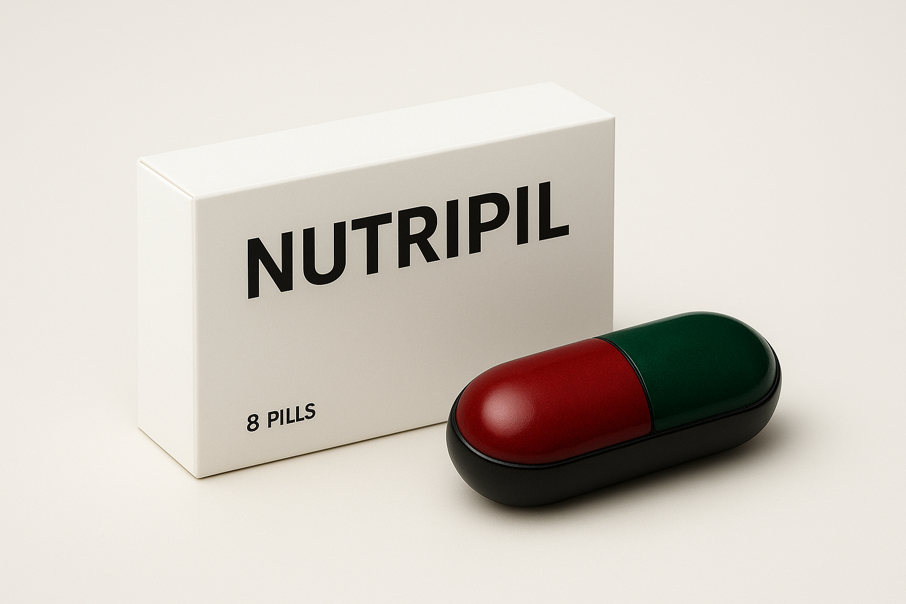

# NutriPills - Nutrición del Futuro



NutriPills es un sitio web moderno para una marca revolucionaria de suplementos nutricionales que ofrece nutrición completa en una sola píldora.

## 🚀 Características del Proyecto

- **Landing page moderna** con diseño atractivo y profesional
- **Página de productos** con selección de sabores y cantidad
- **Sistema de carrito** funcional con localStorage
- **Formulario de contacto** integrado con Web3Forms
- **Sección FAQ** completa e informativa
- **Diseño responsive** optimizado para todos los dispositivos
- **Dark mode** por defecto con estética premium

## 🛠️ Tecnologías Utilizadas

- [Astro](https://astro.build) - Framework web moderno
- [Tailwind CSS](https://tailwindcss.com) - Framework de estilos
- JavaScript vanilla para interactividad
- Web3Forms para el sistema de contacto

## 📁 Estructura del Proyecto

```text
/
├── public/
│   ├── pildora_vr.png
│   ├── pildora_ar.png
│   ├── pildora_rr.png
│   └── pildora_va.png
├── src/
│   ├── components/
│   │   ├── Header.astro
│   │   ├── Footer.astro
│   │   ├── BotonComprar.astro
│   │   ├── BotonCarrito.astro
│   │   ├── BotonHeader.astro
│   │   ├── FaqS.astro
│   │   └── sectionone-five.astro
│   ├── layouts/
│   │   └── Layout.astro
│   ├── pages/
│   │   ├── index.astro
│   │   ├── Acerca.astro
│   │   ├── Comprar.astro
│   │   ├── Carrito.astro
│   │   ├── CompraF.astro
│   │   └── Contacto.astro
│   └── styles/
│       └── global.css
└── package.json
```

## 🧞 Comandos Disponibles

Todos los comandos se ejecutan desde la raíz del proyecto en una terminal:

| Comando                   | Acción                                           |
| :------------------------ | :----------------------------------------------- |
| `npm install`             | Instala las dependencias                         |
| `npm run dev`             | Inicia el servidor local en `localhost:4321`     |
| `npm run build`           | Construye el sitio para producción en `./dist/`  |
| `npm run preview`         | Previsualiza la build localmente                 |

## 💡 Características Principales

### Página Principal
- Hero section con imagen de fondo
- 5 secciones informativas sobre el producto
- Diseño moderno con efectos hover y transiciones suaves

### Tienda
- Selección de 4 sabores diferentes
- Selección de cantidad
- Cambio dinámico de imagen según el sabor seleccionado
- Cálculo automático de precios

### Carrito de Compras
- Sistema de almacenamiento local (localStorage)
- Gestión completa de productos
- Cálculo de subtotal, envío y total
- Posibilidad de eliminar productos

### Contacto
- Formulario funcional integrado con Web3Forms
- Validación de campos
- Diseño limpio y profesional

## 🎨 Paleta de Colores

El proyecto utiliza una paleta personalizada definida en Tailwind:

- **Verde claro** (#16A34A) - Acentos principales
- **Verde oscuro** (#166534) - Fondos y hover
- **Verde oscuro profundo** (#14532D) - Elementos de énfasis
- **Rojo claro** (#DC2626) - Botones de acción
- **Rojo oscuro** (#991B1B) - Estados hover

## 📧 Contacto

Para más información sobre NutriPills, visita nuestra página de contacto.

---

**NutriPills** - El futuro de la nutrición está aquí.
